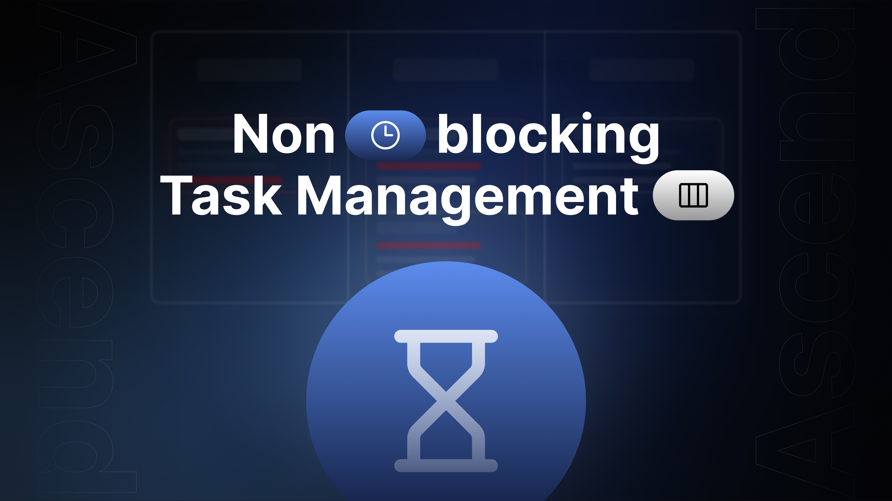
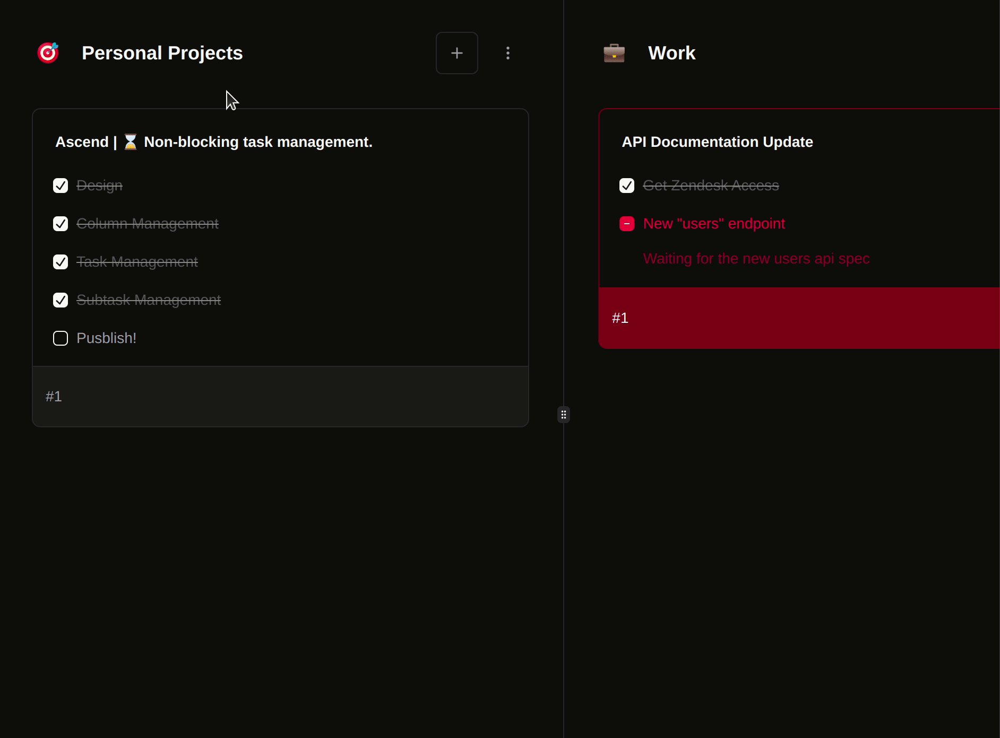
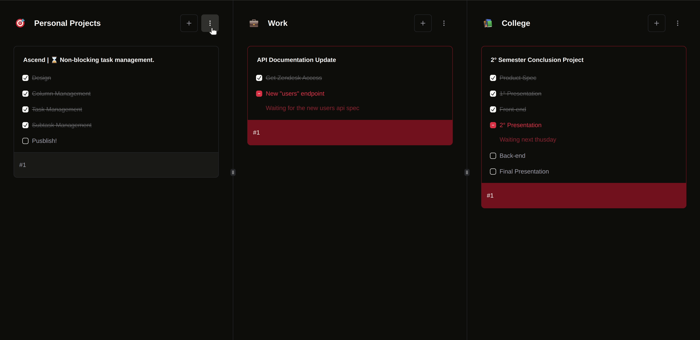
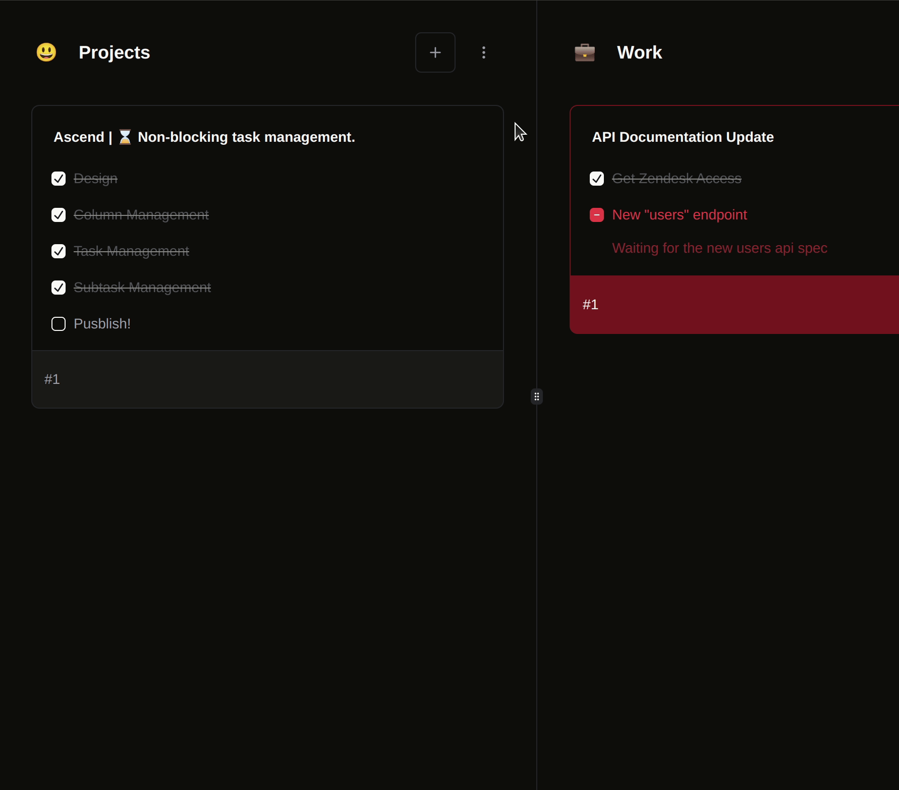
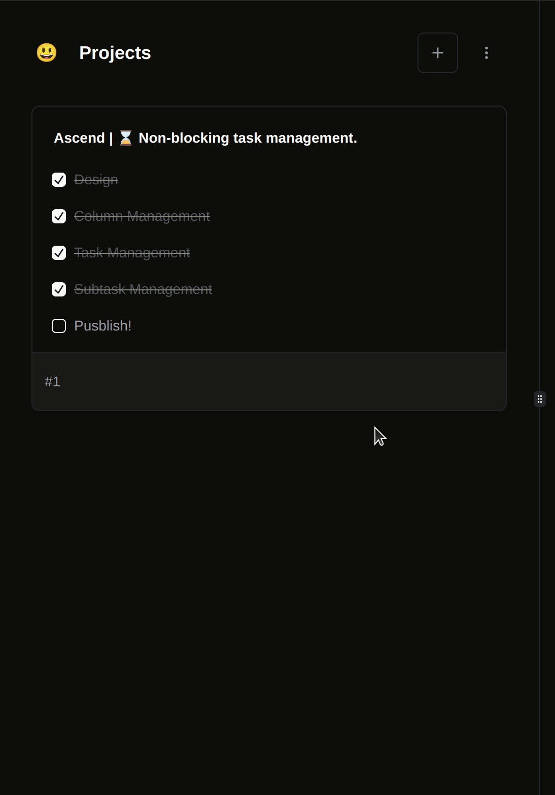
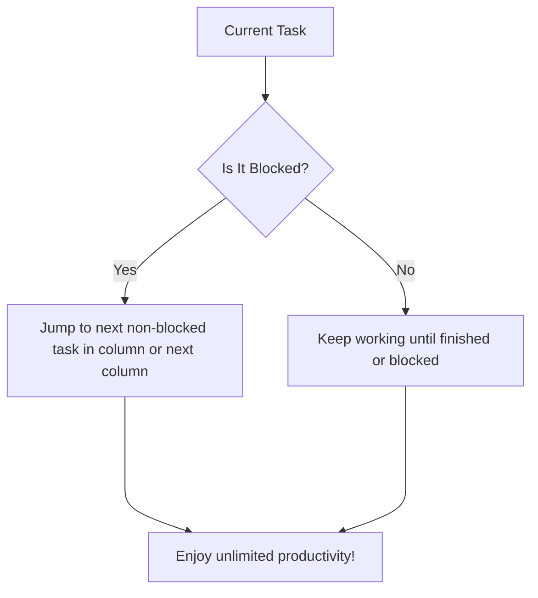
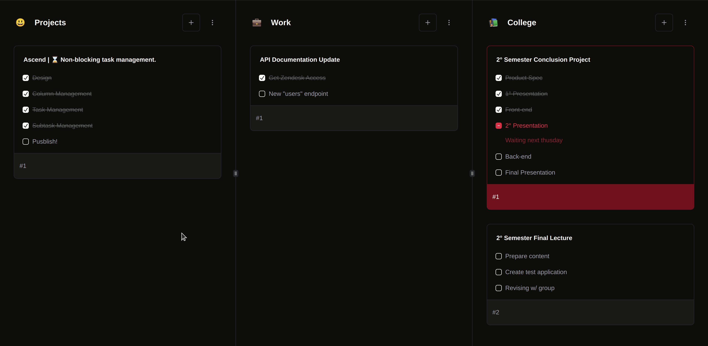

  <table>
    <tbody>
      <td align="center">
         
        <strong>Ascend</strong>
         
        ⌛ Non-blocking task management.
         
        <i>Version: <a href="https://github.com/vitorgouveia/ascend/releases/tag/v0.1">v0.3</a></i>
        
      </td>
    </tbody>
  </table>

 

[Features](#features)  
[Tech Stack](#tech-stack)

---

# Features

### Columns

Columns group tasks into a context, each column has it's own context.
For Example: Personal Projects, Work and College.

Columns have an icon and a title, both can be edited.

Columns can also be deleted.

> But there's no way to create them back yet.

### Tasks

Tasks group various subtasks together, and represent a chunk of work.

Tasks can be created, deleted, blocked (I'll touch on that later).

Tasks titles can also be edited.

### Subtasks

Subtasks represent the smallest unit of work.

Subtasks can be created in tasks, checked, unchecked and blocked.

Blocking a task means that progress dependps on some external person or resource that isn't available now, and if the subtask is blocked we cannot progress on the task itself, forcing a skip to the next available task of that column or the next one.

# Tech Stack

- [next.js](https://nextjs.org)
- [tailwind](https://tailwindcss.com)
- [shadcn](https://ui.shadcn.com)
